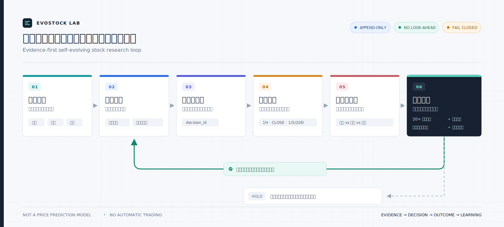

# EvoStock Lab

> 一个会从历史决策中校准自己的股票研究闭环：记录判断，追踪结果，识别错误，让有效规则经过验证后晋级。

[](https://github.com/jiayx01/evostock-lab/actions/workflows/tests.yml)
[](LICENSE)
[](https://www.python.org/)

EvoStock Lab 是一套面向低频、集中持仓场景的开源股票研究框架。它不把每天的分析当成一次性答案，而是把事实、建议、后续成交和结果窗口组成一条可重放的证据链。使用次数越多，系统拥有的真实反馈越多，候选池、风控门禁和选股规则就越能基于证据持续进化。

它不是价格预测器，不会自动下单，也不会因为一天涨跌就修改策略。

## 为什么它会越用越聪明

这里的“自进化”不是偷偷微调模型，而是一个有门禁的经验学习过程：

1. 每次研究结论都有唯一 `decision_id`，当时可见的事实和建议只追加、不回写。
2. 系统按 1 小时、收盘、1/5/20 个交易日结算结果，并区分真实成交、原样持有和建议反事实。
3. 日复盘只记录错误类型，避免用一次盈亏追涨杀跌地改规则。
4. 候选经验先进入待验证区，不会直接影响下一次盘中判断。
5. 规则至少需要 20 个独立信号、覆盖多个市场环境，并通过时间顺序留出验证。
6. 只有交易成本后风险调整结果改善、且最大回撤不恶化，候选规则才允许晋级。



*图 1｜系统只把通过门禁的可信事实转成条件式建议，用户始终保留最终决定权；后续操作与结果经过固定窗口评估和时间顺序验证，只有已批准规则才能反馈到下一次研究。*

### 持久化记忆如何工作

持久化记忆不是一段不断变长的自然语言摘要。不可变事实、决策 episode 和结果事件是权威记录；当前持仓、结果矩阵和相似案例索引都可由事件重建。候选经验只能提供上下文，只有已批准规则可以约束生产决策。完整边界见 [`portfolio_memory_strategy.md`](portfolio_memory_strategy.md)。


*图 2｜每次判断及其后续结果组成可检索案例；当前事实始终优先，历史案例只提供上下文，候选经验必须经过样本、成本和回撤门禁并由用户确认，才会成为可约束动作的规则。*

## 核心能力

- **可重放持仓**：只接受已核验的成交事件，以只追加账本重建仓位。
- **原子证据快照**：邮件索引、成交、隔离区、同步水位、持仓和审计一次提交，避免半成功状态。
- **持续候选池**：候选经过 `研究队列 -> 持续观察 -> 接近触发 -> 开仓候选/待确认`，不把一次技术排名冒充买入建议。
- **市场热度上下文**：覆盖 SPY、QQQ、IWM、半导体与软件 ETF、VIX，并用 RSP/SPY 和 HYG/IEF 观察广度与信用风险偏好。
- **多角色交叉审阅**：提示词定义事实核验、SEC、基本面、估值预期和反方风控五个只读角色；环境支持 agent 时可并行运行。
- **无未来数据复盘**：所有结果计算都要求显式 `as_of`，行情观察时间与采集时间分开。
- **默认失败关闭**：身份、分页、哈希、候选状态或关键行情完整性失败时，不产生新的方向性建议。
- **隐私隔离**：邮箱、持仓、券商事件、截图和报告默认只写入被 Git 忽略的 `data/`。

## 快速开始

要求 Python 3.14。行情下载需要网络连接。

```bash
git clone https://github.com/jiayx01/evostock-lab.git
cd evostock-lab

python3.14 -m venv .venv
source .venv/bin/activate
pip install -r requirements.txt

python bootstrap_local_data.py
python analyze_portfolio.py \
  --holdings examples/holdings.example.csv \
  --skip-commit-verify \
  --skip-snapshot-log
```

演示命令使用匿名样例持仓，只验证分析链路，不代表推荐任何证券。报告会写入 `data/reports/`。

运行测试：

```bash
python -m unittest discover -s tests -v
```

## 接入自己的数据

`bootstrap_local_data.py` 只创建缺失文件，绝不覆盖已有内容。默认私有目录是 `data/`；也可把它放到仓库外：

```bash
export EVOSTOCK_DATA_DIR=/path/to/private/evostock-data
python bootstrap_local_data.py
```

最小手动流程是编辑 `data/holdings_current.csv` 后运行：

```bash
python analyze_portfolio.py --skip-commit-verify
```

完整闭环建议按以下顺序接入：

1. 以 `examples/broker_email_profile.example.json` 为模板创建邮箱与券商配置。
2. 在外部 Gmail 连接器中核验当前账号、发件人、主题模板、成交状态词、时区和分页完整性。
3. 把邮件标准化为 `examples/broker_sync_batch.example.json` 的批次契约。
4. 用 `rebuild_holdings_from_broker_events.py` 建立首次可验证持仓，再用 `commit_broker_sync_batch.py --migrate-existing` 启用原子 generation。
5. 用 `midnight_portfolio_automation_prompt.md` 每日统一执行结果补算、经验召回、持仓研究和决策留痕；其他提示词提供盘中细节与收盘复盘口径。

邮箱授权由外部连接器负责。本仓库不保存 OAuth Token、Cookie 或 API Key，也不会绕过邮箱身份核验。

## 项目结构

| 路径 | 作用 |
|---|---|
| `analyze_portfolio.py` | 行情、趋势、风险、市场热度和候选发现底稿 |
| `rebuild_holdings_from_broker_events.py` | 从已核验成交事件确定性重建持仓 |
| `commit_broker_sync_batch.py` | 原子提交券商同步 generation |
| `apply_chat_holdings_overlay.py` | 提交不污染券商账本的聊天持仓分析视图 |
| `append_decision_event.py` | 只追加决策与邮件发送状态机 |
| `append_outcome_price_bar.py` | 只追加、带交易日校验的结果行情观察 |
| `calculate_decision_outcomes.py` | 无未来数据的固定窗口结果计算器 |
| `midnight_portfolio_automation_prompt.md` | 每日午夜一次完成结果补算、经验召回与持仓判断 |
| `portfolio_memory_strategy.md` | 事实、决策、结果、经验与生效规则的持久化边界 |
| `diagrams/*.yaml` | README 两张学术图的权威图源；版本化保存节点、图标、连线与配色语义 |
| `scripts/render_architecture_figures.py` | 从 YAML 图源生成可编辑 `.drawio` 及 SVG/PNG 学术图 |
| `config/candidate_selection_policy.md` | 候选漏斗、评分、升级和淘汰规则 |
| `experience/` | 候选经验与已生效规则的版本边界 |
| `*_automation_prompt.md` | 日常、盘中和收盘后的 agent 工作流 |
| `examples/` | 匿名输入与配置示例 |
| `data/` | 私有运行数据；除 `.gitkeep` 外全部忽略 |

## 安全边界

- 不自动下单，不承诺收益，不输出确定性价格预测。
- 持仓数量、市值、仓位占比和总盈亏是事实记录，不是默认买卖触发器。
- 缺失数据保留为空或“待确认”，不会填成 0 或安全信号。
- 时间相邻只能说明成交发生在建议之后，不能证明用户采纳了建议。
- 新规则必须保留旧版本、样本窗口、验证结果和适用边界。
- 集中持仓可能带来显著回撤；本项目不替代个人投资判断。

提交漏洞或敏感信息问题前请阅读 [SECURITY.md](SECURITY.md)。

## License

[MIT](LICENSE)
