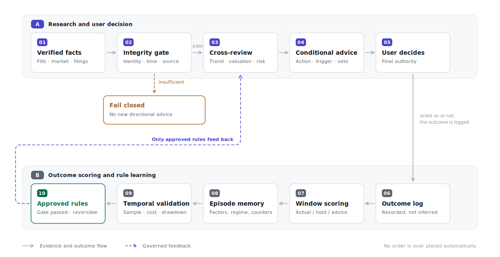
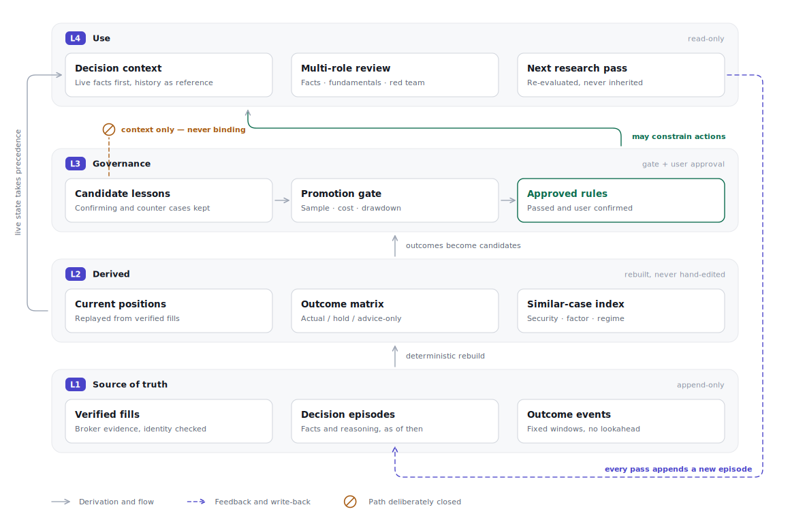

<div align="center">

# EvoStock Lab

**A stock research loop that grades its own past calls — and refuses to promote a rule until the evidence survives a gate.**

[](https://github.com/jiayx01/evostock-lab/actions/workflows/tests.yml)
[](LICENSE)
[](https://www.python.org/)

English · [简体中文](README.zh-CN.md)

</div>

---

Most "AI investing" tools give you an opinion and forget it. EvoStock Lab keeps the receipt.

Every research pass writes an immutable decision record: the facts visible at the time, the reasoning, and the conditional action. The system then scores that decision at fixed windows — 1 hour, close, 1/5/20 trading days — against three baselines: what you actually did, what holding unchanged would have returned, and what the advice alone would have returned. Lessons accumulate in a quarantine area. A lesson only becomes a rule that can constrain future decisions after it clears an explicit gate, and after you approve it.

It runs as a plugin for **Claude Code** and **Codex**, reconstructs holdings from verified broker emails, and never places an order.

### What it is, and what it is not

| It is | It is not |
| --- | --- |
| An append-only ledger of decisions and their measured outcomes | A price predictor or signal service |
| A scheduled research assistant with multi-role cross-review | An auto-trading bot — it has no broker write path |
| A governance layer that gates which lessons may change behaviour | A model that silently fine-tunes on your P&L |
| A deterministic pipeline you can replay from source events | A backtester for strategy discovery |

If a rule change cannot show ≥20 independent signals across multiple market regimes, a post-cost risk-adjusted improvement, and no worsening of max drawdown, it stays a candidate.

## Try it in 60 seconds

No account, no API key, no network, no configuration. `--demo` runs the full analysis pipeline against a synthetic portfolio with deterministic offline prices:

```bash
git clone https://github.com/jiayx01/evostock-lab.git
cd evostock-lab
python3.14 -m venv .venv && source .venv/bin/activate
pip install -r requirements.txt

python analyze_portfolio.py --demo
```

The prices are generated locally from a fixed seed through a single market factor and per-ticker betas, so relative strength, breadth and VIX stay internally consistent — and every machine produces byte-identical output. They are not market data.

The brief it prints covers the market regime and its evidence, a holdings fact table with a drafted action per position, drawdown and tail-risk metrics, a scored discovery queue, and the fact inputs handed to each review role:

```
## 2. 持仓事实表   (Holdings fact table)

|Ticker|价格|数据截止|账户占比(事实)|浮盈亏|20日|相对SPY20日|RSI|状态|动作底稿|
|---|---|---|---|---|---|---|---|---|---|
|MSFT|$423.86|2026-07-17|41.9%|10.8%|0.6%|-2.1%|53.3|趋势中性|继续持有|
|NVDA|$141.72|2026-07-17|14.0%|19.7%|2.1%|-0.7%|52.2|趋势中性|继续持有|
|AVGO|$230.44|2026-07-17|15.2%|36.4%|-1.7%|-4.4%|44.8|趋势中性|继续持有|
|GOOGL|$175.63|2026-07-17|28.9%|15.5%|-1.0%|-3.8%|46.3|趋势转弱/需复核|观望但提高警戒|
```

Note the last row: GOOGL is drafted as *raise alertness* because it broke its 200-day average and lagged SPY over 60 days — not because of its weight. MSFT sits at 41.9% against a 35% ceiling and is still drafted as *hold*, because in this system position size is a recorded fact, never an action trigger on its own.

> **Briefs are currently written in Chinese.** The pipeline, CLI and configuration are language-neutral; only the generated prose is not. English report output is the top open item — see [Roadmap](#roadmap).

## Install as a Claude Code / Codex plugin

The plugin is the automation control plane: Gmail identity verification, broker template setup, scheduled task deployment, run diagnostics and rule promotion. Price math, ledger rebuilds and outcome scoring stay in the deterministic Python in this repo.

**Claude Code**

```bash
claude plugin marketplace add jiayx01/evostock-lab
claude plugin install evostock-lab@evostock
```

Then in a new Claude Code Desktop session: `/evostock-lab:evostock-setup`

**Codex**

```bash
codex plugin marketplace add jiayx01/evostock-lab
codex plugin add evostock-lab@evostock
```

Then in a new Codex task: `$evostock-setup`

| Skill | Purpose |
| --- | --- |
| `evostock-setup` | First deployment: Gmail and broker verification, scheduled task creation |
| `evostock-run` | Executed by intraday, daily, post-close and weekly/monthly background tasks |
| `evostock-status` | Inspect account, ledger, tasks, quarantined events; pause and resume |
| `evostock-review-rules` | Review candidate lessons; promote only after the evidence gate and your approval |

First setup requires one Gmail OAuth round trip, confirmation of the target mailbox and broker email templates, and your approval of the local scheduled tasks it is about to create. **The repo stores no OAuth token, cookie or API key**, and never treats hand-typed holdings as a production ledger. Source precedence is: verified Gmail fills → deterministically derived positions → an analysis overlay, kept separate and marked unconfirmed.

Codex uses desktop Scheduled Tasks, Claude Code uses Desktop Local Scheduled Tasks. Both need the machine awake and the desktop app running. One data directory may have only one active execution side; the other may install the plugin but must not deploy tasks.

## How the loop works

<picture>
  <source media="(prefers-color-scheme: dark)" srcset="assets/figure-decision-loop.en-dark.svg">
  
</picture>

Two properties do the work here. **Fail closed:** if identity, pagination, hashing, candidate state or critical price integrity fails, the system stops producing new directional advice rather than degrading quietly. **Governed feedback:** the only path from a measured outcome back into research runs through temporal validation and your explicit approval — the dashed line is the sole feedback edge in the diagram, and it is guarded.

## How memory works

Persistent memory here is not an ever-growing natural-language summary. It is four layers with different write authority:

<picture>
  <source media="(prefers-color-scheme: dark)" srcset="assets/figure-memory-layers.en-dark.svg">
  
</picture>

Verified fills, decision episodes and outcome events are authoritative and append-only. Current positions, the outcome matrix and the similar-case index are derived — they can be discarded and rebuilt from L1 at any time, and are never hand-edited. Candidate lessons may supply context but are structurally barred from constraining an action; that is the ⊘ in the diagram. Only approved rules cross into the decision context. Full boundaries: [`portfolio_memory_strategy.md`](portfolio_memory_strategy.md).

## Core capabilities

- **Replayable positions** — only verified fill events are accepted; holdings are rebuilt from an append-only ledger.
- **Atomic evidence snapshots** — mail index, fills, quarantine, sync watermark, positions and audit commit together, so there is no half-applied state.
- **Persistent candidate funnel** — candidates move through `research queue → watching → near trigger → open candidate/unconfirmed`. A technical ranking is never passed off as a buy call.
- **Market context** — SPY, QQQ, IWM, semiconductor and software ETFs, VIX, plus RSP/SPY for breadth and HYG/IEF for credit risk appetite.
- **Multi-role cross-review** — five read-only roles: fact verification, SEC filings, fundamentals, valuation expectations, and an adversarial risk desk. Run in parallel where the environment supports agents.
- **No-lookahead scoring** — every outcome calculation requires an explicit `as_of`; observation time and collection time are stored separately.
- **Missing stays missing** — absent data is recorded as blank or unconfirmed, never backfilled with 0 or read as a safe signal.
- **Privacy isolation** — the plugin writes mail, positions, broker events, screenshots and reports to `~/.evostock-lab/data`. Running from source uses a git-ignored `data/`.

## Connect your own data

`bootstrap_local_data.py` only creates missing files and never overwrites existing content. The default private directory is `data/`, and it can live outside the repo:

```bash
export EVOSTOCK_DATA_DIR=/path/to/private/evostock-data
python bootstrap_local_data.py
```

The production path is `evostock-setup`, which onboards in this order:

1. Create the mailbox and broker config from [`examples/broker_email_profile.example.json`](examples/broker_email_profile.example.json).
2. Verify the current account, senders, subject templates, fill status words, timezone and pagination completeness in the external Gmail connector.
3. Normalise mail into the batch contract in [`examples/broker_sync_batch.example.json`](examples/broker_sync_batch.example.json).
4. Commit the first atomic generation with `commit_broker_sync_batch.py` and rebuild positions from verified events.
5. Record Gmail, broker template, active execution side and platform task IDs as deployment evidence via `scripts/evostockctl.py`.
6. Run `automation_gate.py` on every platform wake-up. Only after Stage 0 passes does `evostock-run` load Gmail, investment rules, outcome memory and multi-role review.

Mailbox authorisation is handled by the external connector. This repo does not store credentials and does not bypass mailbox identity verification.

Manual invocations like `python analyze_portfolio.py --skip-commit-verify` are for anonymised demos and development only — never a production holdings source.

## Project layout

| Path | Role |
| --- | --- |
| `analyze_portfolio.py` | Price, trend, risk, market-heat and candidate-discovery brief (`--demo` for offline runs) |
| `rebuild_holdings_from_broker_events.py` | Deterministic position rebuild from verified fill events |
| `commit_broker_sync_batch.py` | Atomic commit of a broker sync generation |
| `apply_chat_holdings_overlay.py` | Chat-sourced analysis view that never contaminates the broker ledger |
| `append_decision_event.py` | Append-only decision and mail-delivery state machine |
| `append_outcome_price_bar.py` | Append-only outcome observations with trading-day validation |
| `calculate_decision_outcomes.py` | No-lookahead fixed-window outcome calculator |
| `automation_gate.py` | XNYS Stage 0 hard gate for intraday, daily, post-close and weekly/monthly modes |
| `scripts/evostockctl.py` | Deployment state machine for Gmail, broker, execution side and platform tasks |
| `scripts/render_figures.py` | Regenerates the README figures — pure stdlib, no external toolchain |
| `plugins/evostock-lab/` | Four automation skills and dual manifests shared by Claude Code and Codex |
| `midnight_portfolio_automation_prompt.md` | Daily review, lesson recall and position judgement contract |
| `portfolio_memory_strategy.md` | Persistence boundaries across facts, decisions, outcomes, lessons and live rules |
| `config/candidate_selection_policy.md` | Candidate funnel, scoring, promotion and elimination rules |
| `experience/` | Version boundary between candidate lessons and live rules |
| `examples/` | Anonymised inputs and configuration samples |
| `data/` | Private runtime data; everything but `.gitkeep` is ignored |

## Roadmap

Contributions welcome on any of these — see [CONTRIBUTING.md](CONTRIBUTING.md).

- [ ] **English report output.** The pipeline is language-neutral; `build_report` is not. Needs a string table and a `--lang` flag.
- [ ] **Worked promotion example.** `experience/approved_rules.md` states rules without showing a candidate that passed the gate with its sample window and post-cost comparison. The gate deserves a visible instance.
- [ ] **Wider Python support.** Currently pinned to 3.14 with aggressive dependency pins; a tested floor of 3.11 would remove a real adoption barrier.
- [ ] **Broker template coverage.** Only the templates you verify locally exist today; contributed and anonymised parser profiles would help.

## Safety boundaries

- No automatic orders, no return promises, no deterministic price forecasts.
- Share count, market value, position weight and total P&L are recorded facts, not default buy or sell triggers.
- Missing data stays blank or unconfirmed. It is never filled with 0 and never read as a safe signal.
- Temporal adjacency shows only that a fill happened after a piece of advice. It does not prove the advice was adopted.
- A new rule must retain the prior version, its sample window, its validation result and its scope of applicability.
- Concentrated positions can produce severe drawdowns. This project does not replace your own investment judgement.

Please read [SECURITY.md](SECURITY.md) before reporting a vulnerability or a data-exposure issue.

## License

[MIT](LICENSE)
