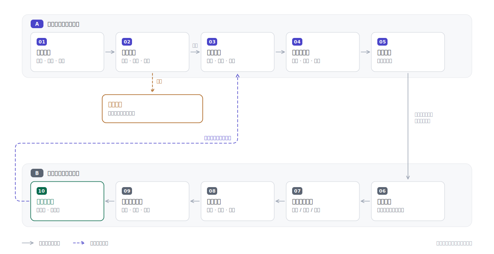
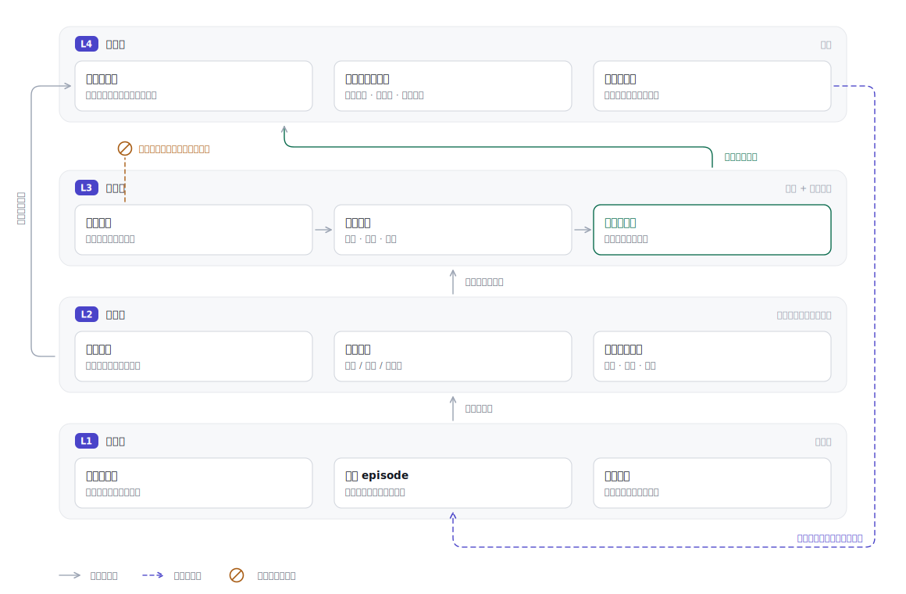

<div align="center">

# EvoStock Lab

**一个会给自己过去的判断打分的股票研究闭环——规则想要生效，必须先过证据门禁。**

[](https://github.com/jiayx01/evostock-lab/actions/workflows/tests.yml)
[](LICENSE)
[](https://www.python.org/)

[English](README.md) · 简体中文

</div>

---

大多数「AI 炒股」工具给你一个观点，然后就忘了。EvoStock Lab 会把凭据留下来。

每一次研究都会写下一条不可变的决策记录：当时看得见的事实、推理过程、以及条件式动作。之后系统在固定窗口结算这次判断——1 小时、收盘、1/5/20 个交易日——并且同时对照三个基准：你实际做了什么、原样持有会是什么结果、只按建议操作又会是什么结果。经验先进入隔离区。只有通过明确的门禁、并且经你批准，一条经验才会变成能约束后续判断的规则。

它以插件形式运行在 **Claude Code** 和 **Codex** 上，从已核验的券商邮件重建持仓，并且从不下单。

### 它是什么，不是什么

| 它是 | 它不是 |
| --- | --- |
| 一份只追加的决策台账，记录判断和实测结果 | 价格预测器或信号服务 |
| 一个带多角色交叉审阅的定时研究助手 | 自动交易机器人——它没有券商写入通道 |
| 一个治理层，决定哪些经验有资格改变行为 | 拿你的盈亏偷偷微调的模型 |
| 一条可从源事件完整重放的确定性管线 | 用来挖策略的回测框架 |

一条规则变更如果拿不出至少 20 个独立信号、跨越多个市场环境、交易成本后风险调整结果改善、且最大回撤不恶化，它就只能待在候选区。

## 60 秒试一下

不需要账号、API Key、网络或任何配置。`--demo` 用一个合成组合和确定性离线行情，跑完整条分析管线：

```bash
git clone https://github.com/jiayx01/evostock-lab.git
cd evostock-lab
python3.14 -m venv .venv && source .venv/bin/activate
pip install -r requirements.txt

python analyze_portfolio.py --demo
```

行情由固定随机种子在本地生成，走的是「单一市场因子 + 每只标的自己的 beta」，所以相对强弱、市场广度和 VIX 之间保持内部一致，而且任何机器跑出来的结果逐字节相同。它们不是真实行情。

生成的底稿覆盖：市场环境及其依据、带每个仓位动作底稿的持仓事实表、回撤与尾部风险指标、打过分的发现队列，以及交给各个审阅角色的事实输入：

```
## 2. 持仓事实表

|Ticker|价格|数据截止|账户占比(事实)|浮盈亏|20日|相对SPY20日|RSI|状态|动作底稿|
|---|---|---|---|---|---|---|---|---|---|
|MSFT|$423.86|2026-07-17|41.9%|10.8%|0.6%|-2.1%|53.3|趋势中性|继续持有|
|NVDA|$141.72|2026-07-17|14.0%|19.7%|2.1%|-0.7%|52.2|趋势中性|继续持有|
|AVGO|$230.44|2026-07-17|15.2%|36.4%|-1.7%|-4.4%|44.8|趋势中性|继续持有|
|GOOGL|$175.63|2026-07-17|28.9%|15.5%|-1.0%|-3.8%|46.3|趋势转弱/需复核|观望但提高警戒|
```

注意最后一行：GOOGL 被判为「观望但提高警戒」，是因为它跌破 200 日均线且 60 日弱于 SPY，**不是**因为仓位大小。而 MSFT 占到 41.9%、超过 35% 的上限，动作底稿仍然是「继续持有」——在这套系统里，仓位是被记录的事实，它自己不构成动作触发器。

## 安装为 Claude Code / Codex 插件

插件是自动化控制面：负责 Gmail 身份核验、券商模板初始化、定时任务部署、运行诊断和规则晋级。行情计算、账本重建和结果评估仍由仓库里的确定性 Python 脚本完成。

**Claude Code**

```bash
claude plugin marketplace add jiayx01/evostock-lab
claude plugin install evostock-lab@evostock
```

然后在 Claude Code Desktop 新会话中运行：`/evostock-lab:evostock-setup`

**Codex**

```bash
codex plugin marketplace add jiayx01/evostock-lab
codex plugin add evostock-lab@evostock
```

然后在 Codex 新建任务中运行：`$evostock-setup`

| Skill | 用途 |
| --- | --- |
| `evostock-setup` | 首次部署：Gmail 与券商核验、创建定时任务 |
| `evostock-run` | 供盘中、每日、收盘后和周/月后台任务执行 |
| `evostock-status` | 检查账号、账本、任务和隔离事件；暂停与恢复 |
| `evostock-review-rules` | 审阅候选经验，过证据门禁并经你批准后才晋级 |

首次 Setup 需要完成一次 Gmail OAuth、确认目标邮箱和券商邮件模板，并批准即将创建的本地定时任务。**本仓库不保存任何 OAuth Token、Cookie 或 API Key**，也不会把手工输入的持仓当作生产账本。来源优先级是：已核验 Gmail 成交 → 确定性派生持仓 → 独立存放并标记待确认的分析 overlay。

Codex 用桌面端 Scheduled Tasks，Claude Code 用 Desktop Local Scheduled Tasks。两者都要求电脑开机且桌面应用运行。同一数据目录只能有一个活动执行端，另一端可以装插件但不得同时部署任务。

## 闭环怎么跑

<picture>
  <source media="(prefers-color-scheme: dark)" srcset="assets/figure-decision-loop.zh-dark.svg">
  
</picture>

真正起作用的是两个性质。**失败即停**：身份、分页、哈希、候选状态或关键行情完整性任一失败时，系统停止产出新的方向性建议，而不是悄悄降级继续输出。**受治理的反馈**：从实测结果回到研究环节只有一条通路，且必须穿过时间顺序验证和你的明确批准——图里那条虚线是唯一的反馈边，而且是带门禁的。

## 记忆怎么工作

这里的持久化记忆不是一段不断变长的自然语言摘要，而是四层写入权限不同的结构：

<picture>
  <source media="(prefers-color-scheme: dark)" srcset="assets/figure-memory-layers.zh-dark.svg">
  
</picture>

已核验成交、决策 episode 和结果事件是权威记录，只追加。当前持仓、结果矩阵和相似案例索引是派生的——随时可以丢弃并从 L1 重建，也从不手工修改。候选经验可以提供上下文，但在结构上被禁止约束动作，也就是图里那个 ⊘。只有已批准规则能进入决策上下文。完整边界见 [`portfolio_memory_strategy.md`](portfolio_memory_strategy.md)。

## 核心能力

- **可重放持仓**：只接受已核验的成交事件，以只追加账本重建仓位。
- **原子证据快照**：邮件索引、成交、隔离区、同步水位、持仓和审计一次提交，不存在半成功状态。
- **持续候选池**：候选经过 `研究队列 → 持续观察 → 接近触发 → 开仓候选/待确认`，不把一次技术排名冒充买入建议。
- **市场热度上下文**：覆盖 SPY、QQQ、IWM、半导体与软件 ETF、VIX，并用 RSP/SPY 和 HYG/IEF 观察广度与信用风险偏好。
- **多角色交叉审阅**：五个只读角色——事实核验、SEC 文件、基本面、估值预期、反方风控；环境支持 agent 时并行运行。
- **无未来数据复盘**：所有结果计算都要求显式 `as_of`，行情观察时间与采集时间分开存储。
- **缺失就是缺失**：缺数据保留为空或「待确认」，不填成 0，也不当作安全信号。
- **隐私隔离**：插件默认把邮箱、持仓、券商事件、截图和报告写入 `~/.evostock-lab/data`；直接跑源码时用被 Git 忽略的 `data/`。

## 接入自己的数据

`bootstrap_local_data.py` 只创建缺失文件，绝不覆盖已有内容。默认私有目录是 `data/`，也可以放到仓库外：

```bash
export EVOSTOCK_DATA_DIR=/path/to/private/evostock-data
python bootstrap_local_data.py
```

正式闭环走 `evostock-setup`，接入顺序是：

1. 以 [`examples/broker_email_profile.example.json`](examples/broker_email_profile.example.json) 为模板创建邮箱与券商配置。
2. 在外部 Gmail 连接器中核验当前账号、发件人、主题模板、成交状态词、时区和分页完整性。
3. 把邮件标准化为 [`examples/broker_sync_batch.example.json`](examples/broker_sync_batch.example.json) 的批次契约。
4. 用 `commit_broker_sync_batch.py` 一次提交首个原子 generation，并从已核验事件重建持仓。
5. 用 `scripts/evostockctl.py` 留下 Gmail、券商模板、活动执行端和平台任务 ID 的部署证据。
6. 每次平台唤醒先运行 `automation_gate.py`；只有 Stage 0 通过后，`evostock-run` 才加载 Gmail、投资规则、结果记忆和多角色审阅。

邮箱授权由外部连接器负责。本仓库不保存凭据，也不会绕过邮箱身份核验。

`python analyze_portfolio.py --skip-commit-verify` 这类手动命令只适合匿名演示和开发调试，不是生产持仓来源。

## 项目结构

| 路径 | 作用 |
| --- | --- |
| `analyze_portfolio.py` | 行情、趋势、风险、市场热度和候选发现底稿（`--demo` 为离线模式） |
| `rebuild_holdings_from_broker_events.py` | 从已核验成交事件确定性重建持仓 |
| `commit_broker_sync_batch.py` | 原子提交券商同步 generation |
| `apply_chat_holdings_overlay.py` | 提交不污染券商账本的聊天持仓分析视图 |
| `append_decision_event.py` | 只追加的决策与邮件发送状态机 |
| `append_outcome_price_bar.py` | 只追加、带交易日校验的结果行情观察 |
| `calculate_decision_outcomes.py` | 无未来数据的固定窗口结果计算器 |
| `automation_gate.py` | 支持盘中、每日、收盘、周/月模式的 XNYS Stage 0 硬门禁 |
| `scripts/evostockctl.py` | Gmail、券商、执行端和平台任务的部署状态机 |
| `scripts/render_figures.py` | 重新生成 README 图；纯标准库，无外部工具链 |
| `plugins/evostock-lab/` | Claude Code 与 Codex 共用的四个自动化 Skill 和双 manifest |
| `midnight_portfolio_automation_prompt.md` | 每日综合复盘、经验召回与持仓判断契约 |
| `portfolio_memory_strategy.md` | 事实、决策、结果、经验与生效规则的持久化边界 |
| `config/candidate_selection_policy.md` | 候选漏斗、评分、升级和淘汰规则 |
| `experience/` | 候选经验与已生效规则的版本边界 |
| `examples/` | 匿名输入与配置示例 |
| `data/` | 私有运行数据；除 `.gitkeep` 外全部忽略 |

## 路线图

以下每一项都欢迎贡献，参见 [CONTRIBUTING.md](CONTRIBUTING.md)。

- [ ] **英文报告输出。** 管线本身与语言无关，`build_report` 不是。需要抽出字符串表并加 `--lang` 参数。
- [ ] **一个走完晋级流程的实例。** `experience/approved_rules.md` 现在只列规则，没有展示某条候选是怎么带着样本窗口和成本后对比通过门禁的。门禁值得有一个看得见的实例。
- [ ] **放宽 Python 版本。** 目前锁在 3.14 且依赖版本很激进；把下限测到 3.11 能去掉一个真实的采用门槛。
- [ ] **券商模板覆盖。** 现在只有你本地核验过的模板；欢迎贡献匿名化的解析配置。

## 安全边界

- 不自动下单，不承诺收益，不输出确定性价格预测。
- 持仓数量、市值、仓位占比和总盈亏是事实记录，不是默认买卖触发器。
- 缺失数据保留为空或「待确认」，不填成 0，也不当作安全信号。
- 时间相邻只能说明成交发生在建议之后，不能证明用户采纳了建议。
- 新规则必须保留旧版本、样本窗口、验证结果和适用边界。
- 集中持仓可能带来显著回撤；本项目不替代个人投资判断。

提交漏洞或敏感信息问题前请阅读 [SECURITY.md](SECURITY.md)。

## License

[MIT](LICENSE)
